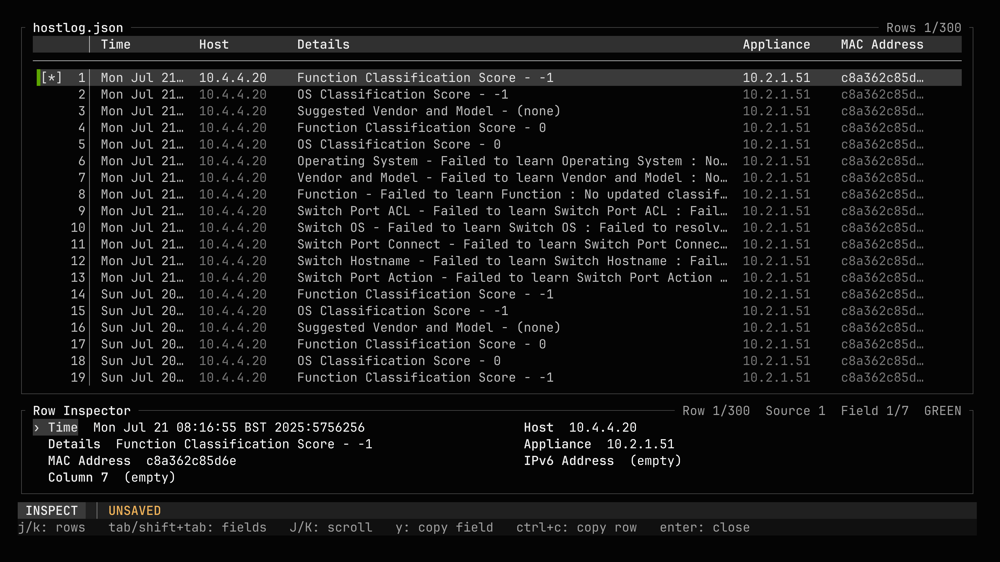
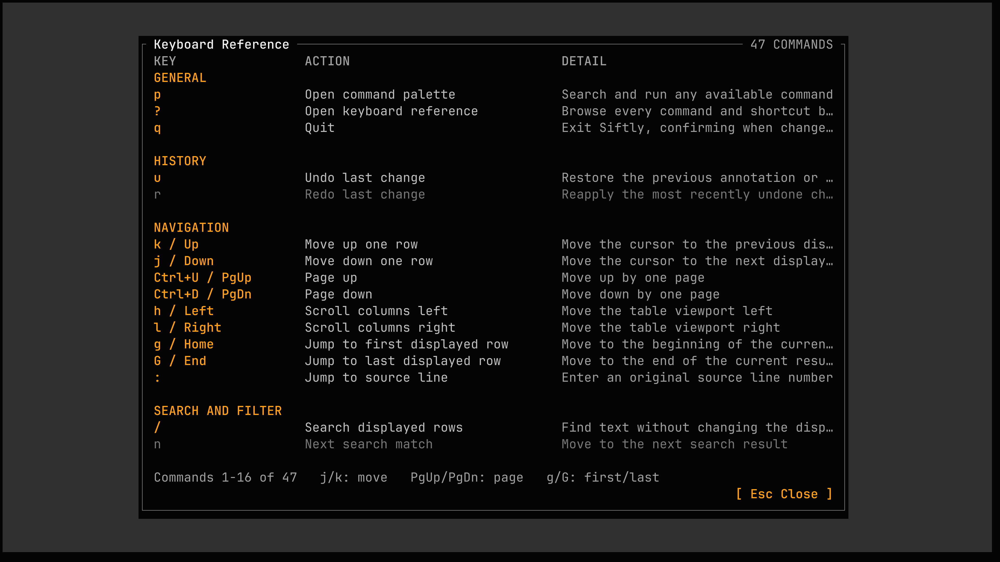

# Siftly

Siftly is a terminal toolkit for reviewing structured operational data without moving an investigation into spreadsheets or long `grep` pipelines. The shared interface supports filtering, search, range selection, RAG marks, comments, column management, saved Siftly JSON snapshots, and filtered data export.



## Applications

| Application | Input |
|---|---|
| `hostlog` | Eyesight host-log CSV or saved Siftly JSON |
| `todaylog` | Raw today log or saved Siftly JSON |
| `pluginlog` | Plugin log or saved Siftly JSON |
| `devfmt` | Device-info dump, selected by group/category |

`todaylog` also provides a time-series graph and SVG graph export.

## Build

Go 1.24 or later is required.

```bash
mkdir -p dist
go build -o dist/hostlog ./cmd/hostlog
go build -o dist/todaylog ./cmd/todaylog
go build -o dist/pluginlog ./cmd/pluginlog
go build -o dist/devfmt ./cmd/devfmt
```

Use `make release` to build the complete cross-platform release set.

## Run

An input path can be positional or supplied with `--input`/`-i`.

```bash
./dist/hostlog testdata/hostlog.csv
./dist/todaylog /path/to/today.log
./dist/pluginlog /path/to/plugin.log
./dist/devfmt export --input /path/to/devinfo.dump.gz --group sw
```

Common options:

```text
--debug PATH            Write diagnostic logs to PATH
--filter-presets PATH   Read application filter presets from PATH
--filter-history PATH   Save filter history to PATH
```

Relative filter preset and history paths are resolved from the process working directory. `todaylog` also accepts `--prefilter REGEX` to reduce raw input before it is parsed; `Ctrl+R` reloads the complete source when a prefilter is active.

## Interface

The table uses single-line rows for scanning. The current row has the stronger grey background; a range selection uses the darker mid-grey background. The two-line footer reports the current mode, active states such as `FILTER`, `SORT`, `TIME WINDOW`, `MARKS ONLY`, `SELECTED`, and `UNSAVED`, plus context-sensitive key hints and notices.

Press `?` for the categorized keyboard reference or `p` to search and run commands from the command palette.



### Core keys

| Key | Action |
|---|---|
| `j` / `k`, `Down` / `Up` | Move through displayed rows |
| `Ctrl+D` / `Ctrl+U`, `PgDn` / `PgUp` | Move by one page |
| `h` / `l`, `Left` / `Right` | Scroll columns |
| `g` / `G`, `Home` / `End` | Jump to the first/last displayed row |
| `:` | Jump to an original source line |
| `/`, then `n` / `N` | Search; move to next/previous match |
| `f` / `F` | Enter a whole-row regex filter / toggle the current filter |
| `f Ctrl+P` / `f Ctrl+H` | Open filter presets / filter history |
| `Space` / `Esc` | Start or clear a displayed-row range selection |
| `Ctrl+C` | Copy the current row or selected rows |
| `m [count] r|g|a|c` | Mark or clear selected rows, or the current and next count displayed rows |
| `]` / `[` | Jump to the next/previous displayed marked row |
| `M` | Toggle marked rows only |
| `c e` / `c v` | Edit the current-row comment / toggle the comment drawer |
| `Enter` | Toggle the row inspector |
| `v` | Open the column manager |
| `t w` | Open the time-window editor |
| `w` | Toggle the graph when graph support is enabled |
| `u` / `r` | Undo / redo |
| `q` | Quit, with confirmation when changes are unsaved |

The row inspector exposes complete, untruncated values. While it is open, use `Tab`/`Shift+Tab` to change field, `J`/`K` to scroll, and `y` to copy the focused value.

## Save And Export

| Key | Output |
|---|---|
| `s` | Save a reloadable Siftly JSON snapshot containing source data, marks, comments, and Siftly state |
| `e d` | Export the currently filtered rows as CSV |
| `e g` | Export the current graph as `<input>-graph-YYYY-MM-DD_HH-MM-SS.svg` when graph support is enabled |

Snapshots deliberately retain their own source data so reopening a session does not depend on an external file remaining unchanged. The compact JSON schema stores column names once and rows as single-line arrays.

See [howto.md](howto.md) for task-oriented workflows.
