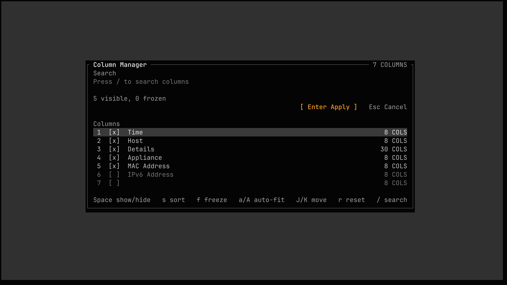

# Siftly How-To Guide

This guide covers the shared interface used by `hostlog`, `todaylog`, and `pluginlog`. Commands that depend on an application feature, such as the `todaylog` graph, appear in help only when that feature is available.

## Start An Application

Build the local binaries:

```bash
mkdir -p dist
go build -o dist/hostlog ./cmd/hostlog
go build -o dist/todaylog ./cmd/todaylog
go build -o dist/pluginlog ./cmd/pluginlog
```

Open source data or a saved Siftly JSON snapshot:

```bash
./dist/hostlog testdata/hostlog.csv
./dist/todaylog /path/to/today.log
./dist/pluginlog /path/to/plugin.log
```

Use `-d debug.log` when diagnostic logging is needed. The application writes relative `--filter-presets` and `--filter-history` paths in the directory from which it was launched.

## Read The Interface


- The framed table header shows the input filename, current displayed row count, active filter, marks-only state, and selection count.
- Ordinary columns remain single-line for scanning while primary content columns can wrap to four lines. Open the row inspector with `Enter` when a complete value is needed.
- The first footer line shows the current mode and active states. The second line changes its key hints to match the current mode, prefix, selection, or inspector.
- Notices and long-running operation progress appear at the right of the footer.

Press `?` for the full keyboard reference. Press `p` to search commands by action, category, shortcut, description, or related term.


## Navigate And Inspect Rows

| Task | Keys |
|---|---|
| Move one displayed row | `j` / `k` or `Down` / `Up` |
| Move one page | `Ctrl+D` / `Ctrl+U` or `PgDn` / `PgUp` |
| Scroll columns | `h` / `l` or `Left` / `Right` |
| First/last displayed row | `g` / `G` or `Home` / `End` |
| Original source line | `:`, enter the line number, then `Enter` |
| Toggle row inspector | `Enter` |
| Select inspector field | `Tab` / `Shift+Tab` |
| Scroll inspector | `J` / `K` |
| Copy focused inspector value | `y` |

The current row is independent of a range selection. Commands that operate on rows use the selected displayed-row range when one is active; otherwise they use the current row.

## Search And Filter

### Search Without Hiding Rows

1. Press `/`.
2. Enter case-insensitive text and press `Enter`.
3. Use `n` and `N` for the next and previous match.

The footer reports the current match position, such as `Match 4/127`.

### Filter Displayed Rows

1. Press `f`.
2. Enter a regular expression and press `Enter`.
3. Press `F` to disable or re-enable the configured filter.

Filtering matches one complete logical row, including all columns, so expressions such as `fstool_va.*seq` work across column boundaries without requiring users to enable a multiline regular-expression mode.

While entering a filter, use `Ctrl+P` for configured presets or `Ctrl+R`/`Up` for filter history. The history file is writable state; set `--filter-history /path/to/history.json` when the launch directory is not an appropriate location.

For very large raw today logs, `--prefilter REGEX` reduces data before parsing. This is deliberately separate from the interactive filter. Use the command palette to reload the complete source.

## Select, Copy, And Mark Rows

1. Press `Space` on the first row of a range.
2. Move with the normal navigation keys; the footer reports the number selected.
3. Press `Ctrl+C` to copy the selected rows, or enter a mark command.
4. Press `Space` or `Esc` to clear the range selection.

Mark commands use `r`, `g`, `a`, and `c` for red, green, amber, and clear:

```text
m r       mark the current row red
m 5 g     mark the current row and next five displayed rows green
m c       clear the current row's mark
```

When a range selection is active, `m r`, `m g`, `m a`, or `m c` applies to the selected rows and a numeric count is unnecessary. Use `]`/`[` to move between displayed marked rows and `M` to toggle marked rows only.

## Add Comments

- `c e`: edit or clear the current-row comment.
- `c v`: toggle the comment drawer.

Comments are annotations and set the `UNSAVED` state. The comment drawer and row inspector size themselves to the available terminal space and content.

## Manage Columns

Press `v` to open the column manager.



| Key | Column manager action |
|---|---|
| `/` | Search columns |
| `Space` | Show/hide the focused column |
| `s` | Cycle ascending, descending, and no sort |
| `f` | Freeze/unfreeze the focused column |
| `a` / `A` | Auto-fit the focused/all visible columns |
| `J` / `K` | Move the focused column down/up |
| `r` | Queue a reset to the application defaults |
| `Enter` / `Esc` | Apply/cancel changes |

Frozen columns remain before scrolling columns. The manager prevents hiding the last visible column.

## Set A Time Window

- `t w`: open the time-window editor.
- `t b`: set the start from the current row timestamp.
- `t e`: set the end from the current row timestamp.
- `t r`: reset to the complete source time range.

The footer shows `TIME WINDOW` while a window is active.

## Save And Export

### Save A Reloadable Snapshot

Press `s` to open **Save Siftly JSON**. The snapshot contains its own source data, stable row IDs, marks, comments, and Siftly state, so it remains consistent even if the original backend data later changes. Column names are stored once and row arrays are emitted on single lines to keep files compact and grep-friendly.

### Export Filtered Data

Press `e d` to open **Export Filtered Data**. This writes only the currently filtered rows as CSV and is not a reloadable Siftly session.

### Export A Graph

In a graph-enabled application, press `w` to toggle the graph and `e g` to export it. Graph export writes beside the input file using a timestamped name such as:

```text
today-graph-2026-07-22_14-05-06.svg
```

Save and filtered-data export dialogs begin in the input file's directory and allow the target path to be changed before confirming.

## Recover And Revisit Work

- `u` / `r`: undo or redo annotation and view changes.
- `q`: quit. Unsaved changes require an explicit save, discard, or cancel decision.
- Reopen a Siftly JSON snapshot by passing it to the same application that created it.

```bash
./dist/hostlog /path/to/investigation.json
./dist/todaylog /path/to/today.json
```
